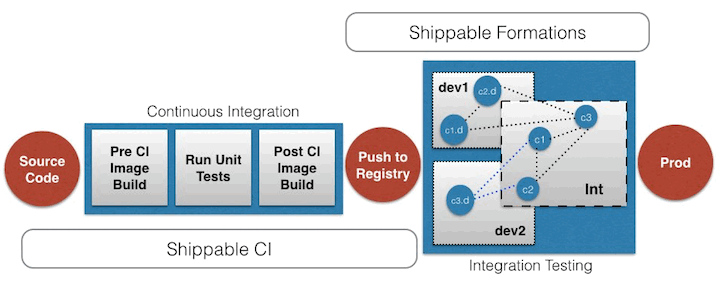

page_title: Learn About What Makes Shippable Great
page_description: Code examples, FAQs, language & platform support
page_keywords: containers, lxc, docker, Continuous Integration, Continuous Deployment, CI/CD, testing, automation

# Overview

## What is Shippable?

Shippable is a SaaS platform for developers and devops teams that significantly reduces the time taken for code to be built, tested and deployed to production.  

Shippable comprises of two products that enables you to ship code faster - 

**Shippable CI:** a platform that allows you to easily add Continuous Integration/Deployment to your Git repositories

**Shippable Formations:** a platform to manage the deployment of multi container applications to Dev and Test Environments

### Shippable CI 
Shippable CI is our Continuous Integration and Deployment Platform
which is lightweight, super simple to setup, and runs your builds and tests
faster than any other service. It uses **Build Minions** which are docker based 
containers to run your workloads.  After building and testing your code, you can push your docker image
to Docker Hub, Google Container Registry or any other private registry. You
can also deploy it to any PaaS provider like Heroku & OpenShift and also to
VMs, bare metal, OpenStack clusters, or any major infrastructure
provider. 

With Shippable CI, you can:

- automate the packaging and deployment of web applications
- automate testing and continuous integration/deployment

### Shippable Formations
Shippable Formations is a system based on Kubernetes that allows you to manage your multi-tier 
application across multiple environments without writing any DevOps code. It is persistent, fully orchestrated 
and scalable. Each of your developers can now have their own fully integrated test environment at a fraction of the cost! 

With Shippable Formations, you can:

- manage multi-container environments that can be easily configured by developers or DevOps teams
- no code deployment and rollback
- easily integrate with existing services
- have persistent, fully orchestrated and scalable dev/test labs
- automate deployment pipelines without machine provisioning

Check out our **Quick Start Guides** to get yourselves set up on **Shippable CI** or **Formations**
 in just a few minutes:

- [Run your first build](build_quickstart.md)
- [Set up your first formation](formations_quickstart.md)
